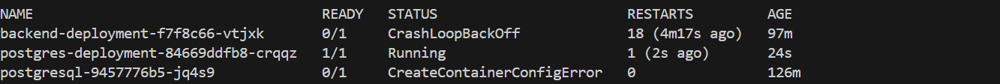

# Rendu du projet Melissa LATEB

## Étapes effectuées lors de ce projet

1. **Clonage et configuration git**
2. **Mise du fichier `kubeconfig.yml` à la racine du projet**

### Exécution des lignes de commande (création de l'environement) :

```sh
$env:KUBECONFIG="C:\Users\mlateb\Desktop\CFA\ICVAD2\Projet final vendredi\kubeconfig.yml"
``` 

3. **Vérifiaction de la connextion** :

```sh 
    kubectl get nodes
```
**Résultat**:
| NAME                                       | STATUS | ROLES  | AGE | VERSION   |
|--------------------------------------------|--------|--------|-----|-----------|
| nodepool-81ca1065-d09f-491b-a4-node-512151 | Ready  | <none> | 40m | v1.29.3   |
| nodepool-81ca1065-d09f-491b-a4-node-6f366f | Ready  | <none> | 35m | v1.29.3   |
| nodepool-81ca1065-d09f-491b-a4-node-f6ce31 | Ready  | <none> | 45m | v1.29.3   |


4.**Création du namespace melissalateb** :
```sh 
    kubectl create namespace melissalateb
```
--> Résultat 
```sh 
    namespace/melissalateb created
```
## Vérification 

```sh 
    kubectl get namespaces
```
--> Résultat 
| NAME         | STATUS | AGE  |
|--------------|--------|------|
| ...          | ...    | ...  |
| melissalateb | Active | 24s  |
| ...          | ...    | ...  |

5. **Lancer le serveur RabbitMQ** :

```sh
    kubectl apply -f "https://github.com/rabbitmq/cluster-operator/releases/latest/download/cluster-operator.yml"
```

--> Résultat 
```powershell 
    namespace/rabbitmq-system unchanged
customresourcedefinition.apiextensions.k8s.io/rabbitmqclusters.rabbitmq.com unchanged
serviceaccount/rabbitmq-cluster-operator unchanged
role.rbac.authorization.k8s.io/rabbitmq-cluster-leader-election-role unchanged
clusterrole.rbac.authorization.k8s.io/rabbitmq-cluster-operator-role unchanged
clusterrole.rbac.authorization.k8s.io/rabbitmq-cluster-service-binding-role unchanged
rolebinding.rbac.authorization.k8s.io/rabbitmq-cluster-leader-election-rolebinding unchanged
clusterrolebinding.rbac.authorization.k8s.io/rabbitmq-cluster-operator-rolebinding unchanged
deployment.apps/rabbitmq-cluster-operator unchanged
```

(unchanged car l'étape a été réalisé lorsdes exercices au cours de la semaine)

### Ajout du fichier "postgresql-deploiement.yaml"

6. **Execution de postgresql-deploiement** :

```sh
    kubectl apply -f "C:\Users\mlateb\Desktop\CFA\ICVAD2\Projet final vendredi\postgresql-deploiement.yaml"
```
--> Résultat

```powershell
    persistentvolumeclaim/postgres-pvc created
    service/postgres-service created
    deployment.apps/postgres-deployment created
```
### Ajout du fichier "backend-deploiement.yaml"

7. **Execution de backend-deploiement** : 

```sh
    kubectl apply -f "C:\Users\mlateb\Desktop\CFA\ICVAD2\Projet final vendredi\backend-deploiement.yaml"
```
--> Résultat
```powershell
    configmap/backend-config created
    deployment.apps/backend-deployment created
    service/backend-service created
```

8. **Construction des images docker** : 
```sh
    docker build -t melissalateb/backend:latest .
``` 
(Attention : il faut se mettre dans le dossier ou se trouve le Docker file ./database/ afin de pouvoir executer la commande docker avec succes)
--> Résultat 
    

## Push les modifications :

```powershell
    docker push melissalateb/backend:latest 
```

--> Résultat 

```powershell
    latest: digest: sha256:1aca98959565825d96fe5d8e3712853331312a0c3a0ad14b6ebdb12f8a9c20f7 size: 3226
```